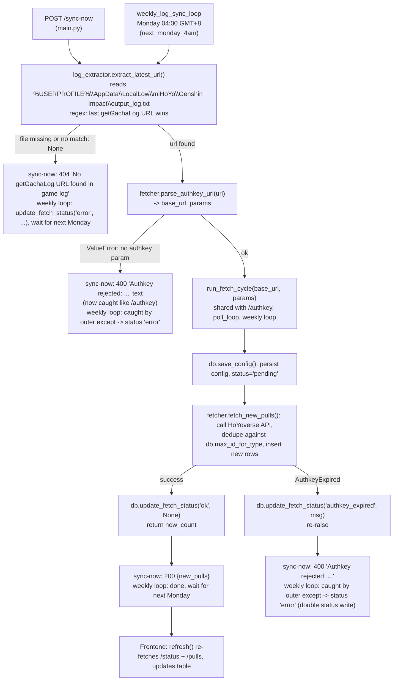

# Sync flow (technical)

For agents working on `/sync-now`, the weekly cron, or `log_extractor.py`/`fetcher.py`. See `workflow.png` for the general picture; this is the detail.

## Known gap (fixed)

`sync_now()` previously didn't wrap `fetcher.parse_authkey_url()` in a try/except like `/authkey` does, so a malformed extracted URL (missing `authkey` param) would 500 instead of a clean 400. Fixed in `main.py`'s `sync_now()`: `ValueError` now maps to `HTTPException(400, ...)`, matching `/authkey`.
